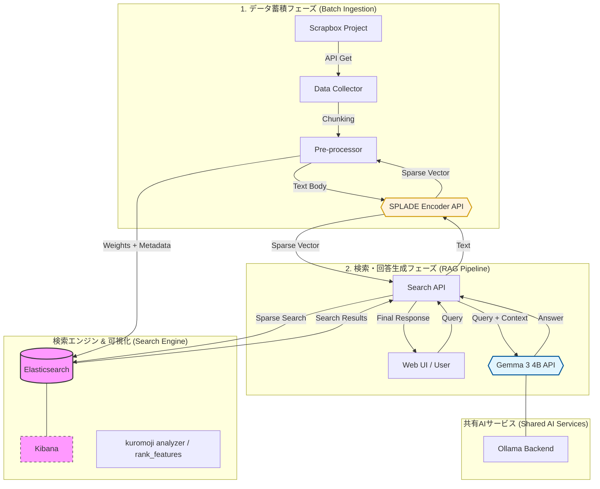

# RAGシステム処理フロー：Scrapbox + SPLADE + Elasticsearch + Gemma 3 4B

## 1. データ蓄積フェーズ（バッチ処理）

Scrapboxの知識を検索可能な状態でElasticsearchに格納するプロセスです。

1. **データ取得**
   - Scrapbox APIを利用し、対象プロジェクトから全ページデータをJSON形式で取得します。
2. **前処理・分割（Chunking / Pre-processing）**
   - 長いページは意味のまとまりごとにテキストを適切な長さに分割（Chunking）します。
   - ページタイトル、最終更新日、URLなどのメタ情報を各チャンクに付与します。
3. **スパースベクトル化（SPLADE Encoder API）**
   - 分割したテキストを **SPLADE Encoder API** (FastAPI) に送信します。
   - 内部のBERTモデル（SPLADE）が、テキストを「語彙拡張（Expansion）」されたスパースベクトル（単語重みの集合）に変換します。
4. **インデックス登録（Indexing）**
   - テキスト、メタデータ、およびSPLADEから返されたベクトル重みを **Elasticsearch** (v8.16) に格納します。
   - `text`および`title`フィールドには **kuromoji analyzer** を適用し、日本語検索に対応しています。
   - `sparse_vector`は `rank_features` 型として定義され、高速なスパースベクトル検索を可能にします。

---

## 2. 検索・回答生成フェーズ（リアルタイム処理）

ユーザーの質問に対して、最適な情報を検索し回答を生成するプロセスです。

1. **クエリ受信**
   - **Web UI** (React + Vite) からユーザーの質問（クエリ）を **Search API** (FastAPI) が受け取ります。
2. **クエリのベクトル化**
   - 質問テキストを **SPLADE Encoder API** に送り、蓄積時と同じモデルでスパースベクトルに変換します。
3. **スパース検索（Retrieval）**
   - 生成されたベクトルを用いて **Elasticsearch** に対して検索を実行します。
   - `rank_features` を用いた検索により、SPLADEによる「意味の拡張」を反映した高度な関連性検索が行われます。
4. **コンテキスト構築**
   - 検索結果からスコアの高い上位数件のテキスト（コンテキスト）と、その出典（Scrapbox URL）を抽出します。
5. **回答生成（Generation）**
   - **Gemma 3 4B API** を通じて、ローカルで動作する **Ollama** バックエンドを呼び出します。
   - 以下の情報をプロンプトとして入力し、回答を生成します。
     - **システムプロンプト**: 「提供されたScrapboxの情報のみに基づいて回答してください」
     - **コンテキスト**: Elasticsearchから取得したページタイトル、テキスト、URL。
6. **レスポンス返却**
   - 生成された回答と、根拠となったソース情報をWeb UIに返却します。

---

## 3. 技術スタック (Technology Stack)

| カテゴリ | 使用技術 |
| :--- | :--- |
| **Frontend** | React, Vite, Tailwind CSS, DaisyUI, Lucide React, Framer Motion |
| **Backend API** | Python 3.12, FastAPI, Pydantic, Loguru |
| **Search Engine** | Elasticsearch 8.16 (kuromoji), Kibana |
| **Machine Learning** | SPLADE (Transformers), Gemma 3 4B (Ollama) |
| **Infrastucture** | Docker, Docker Compose |
| **Data Source** | Scrapbox API |
